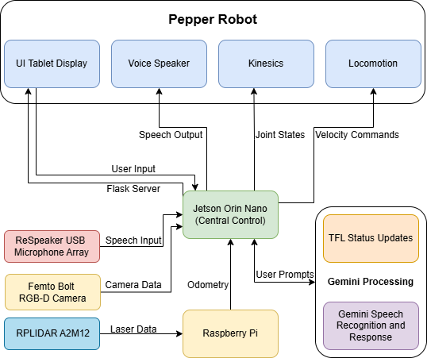

# TFLBot – A Helping Hand in Underground Transport

## Overview
TFLBot is a mobile assistive robot designed to support passengers navigating complex underground transport environments.

It provides:
- Autonomous navigation guidance
- Multimodal interaction (speech, visual feedback, BSL)
- Accessibility-focused assistance

This repository contains **all materials required to understand, reproduce, and extend the project**, ensuring future teams can continue development seamlessly.

---

## Project Aim
The system investigates whether robotic guidance improves:
- Navigation efficiency
- User experience
- Cognitive workload

Two modes were evaluated:
1. Stationary robot (verbal guidance only)
2. Mobile robot (physical + multimodal guidance)

---

## Repository Contents

This repository includes ALL project deliverables:

### Software
- ROS2-based control system
- Speech recognition and NLP integration
- Navigation and path planning algorithms
- Gesture and interaction modules

### Hardware & Schematics


- System architecture design
- Hardware integration (Pepper, Jetson, Raspberry Pi, sensors)
- Wiring/setup details (if applicable)

### Datasheets
- Sensors (RPLIDAR, Femto Bolt camera, microphone array)
- Processing units (Jetson Orin Nano, Raspberry Pi 5)
- Robot platform (Pepper)

### Experimental Results
- Navigation performance metrics
- User study data (time, errors, cognitive load, satisfaction)
- Logs and evaluation outputs

### Supplementary Figures
- System architecture diagrams
- UI screenshots
- Mapping and LiDAR outputs

### Documentation
- Design report
[Design report](Documentation/HumanCenteredRoboticsDesignReport.pdf)
- Final report
- Setup instructions (see below)

### Results

See detailed results here:  
[Results README](results/readme.md)

---

## System Architecture

<p align="center">
  
</p>

<p align="center">
  <em>Figure: High-level system architecture of TFLBot</em>
</p>

The system consists of multiple integrated components:

- **Pepper Robot** (interaction + mobility)
- **Jetson Orin Nano** (central processing)
- **Raspberry Pi 5** (sensor interfacing)
- **Femto Bolt Camera** (vision + tracking)
- **RPLIDAR A2M12** (mapping + collision avoidance)
- **Microphone Array** (speech input)

Key technologies:
- ROS2 Humble
- NAOqi bridge
- Flask-based UI
- Gemini API (NLP)

---

## Features

### 1. Speech Interaction
- Natural language queries
- Google Speech Recognition integration
- Gemini-powered responses :contentReference[oaicite:1]{index=1}

### 2. Sign Language Recognition
- MediaPipe hand tracking
- SVM-based classification
- Supports BSL alphabet and numbers :contentReference[oaicite:2]{index=2}

### 3. Multimodal Communication
- Speech + gesture synchronisation
- Directional pointing
- Visual UI feedback

### 4. Navigation & Mobility
- A* path planning
- LiDAR-based obstacle avoidance
- SLAM mapping
See more details here:  
[Map README](Mapping/maps/README.md)


### 5. User Interface
- Language selection
- Real-time transcription
- BSL interaction mode
- Accessibility-first design

---

## Team Contributions (Who Did What)

| Name | Contribution |
|------|-------------|
| Dhruv Varsani | BSL recognition and vision system (camera integration) |
| Sophie Jayson | User interface and speech processing |
| Sandro Enukidze | Microphone system and audio input |
| Arundhathi Pasquereau | 3D modelling and design assets |
| Adeola Olawoye | System integration |
| Tshepo Nkutlwang | Mapping and environment representation |
| Isobel Owens | Collision avoidance system |
| Dinushan Camilus | Lower body movement and locomotion control |
| Akin Falase | Upper body movement |
| Dylan Winters | Upper body movement, gesture control, and team leadership |


---
## Prerequisites

- Install the NAOqi ROS2 driver by following the official guide:  
  https://github.com/ros-naoqi/naoqi_driver2  

- Ensure the driver is installed in a ROS2 workspace of your choice  

- Install all required Python dependencies:
```bash
pip install -r requirements.txt
```
(If no requirements.txt is provided, install dependencies manually.)

---

## How to Run

### 1. Start the Flask Server (Jetson)

Run the UI server:

```bash
python ros_app.py
```

The server can be accessed from any device connected to the same network.

---

### 2. Display UI on Pepper Tablet

Run the following on the Pepper robot:

```bash
ssh nao@pepper.local "qicli call ALTabletService.showWebview "{url of the webserver}""
```

Notes:

- Use `nao@Pepper` if not using Ethernet  
- Ensure the Jetson and Pepper are on the same network 
- If the Jetson can't discover the Pepper over ethernet, refer to the end of the next section.

---

### 3. Launch NAOqi ROS2 Driver (Jetson)

Source your ROS2 workspace:

```bash
source ros2ws/install/setup.bash
```

Run the driver:

```bash
ros2 launch naoqi_driver naoqi_driver.launch.py nao_ip:=pepper.local
```

Notes:

- If using LAN instead of Ethernet:

```bash
nao_ip:=Pepper
```

- If `pepper.local` does not resolve:
  - Manually configure the IPv4 address  
  - Ensure the first three octets match Pepper’s IP (e.g. 169.254.xxx.xxx)  

---

### 4. Run Core Nodes

```bash
python ros2_bsl_camera_node.py
python actuator.py
```

---

### 5. Launch Navigation Stack

```bash
ros2 launch pepper_nav2_test_with_rviz_fixed.launch.py
```

(Adjust this command based on your Nav2 configuration if needed. The default is:
ros2 launch pepper_nav2_test_with_rviz_fixed.launch.py   map:="floor10lab_map_edited.yaml"   params_file:="pepper_nav2_params.yaml"   rviz_config:="pepper_nav_test.rviz"   bridge_script:="pepper_nav_script.py"
)

---

## Using the System

1. Open the UI and select a language  
2. Choose an interaction mode:
   - Speech input → wait a few seconds, then say your destination  
   - BSL input → stand at least 50 cm away from the camera when signing  

3. If no response is received:
   - Wait approximately 2 seconds  
   - Repeat your input  

4. The robot will guide you to a predefined destination on the map  

Destination locations can be modified while running the Nav2 Launch script using:

```bash
ros2 topic pub --once /pepper_nav/save_named_location std_msgs/msg/String "{data: lift_exit_outside_1}"
```

These will be saved in:

```bash
locations.json
```
