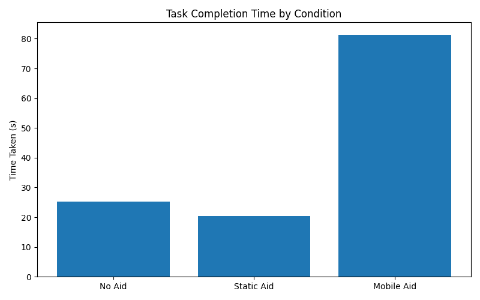
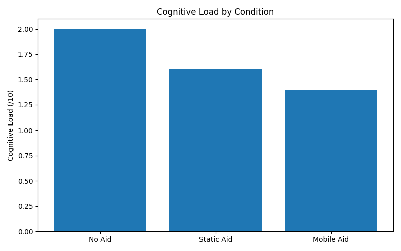
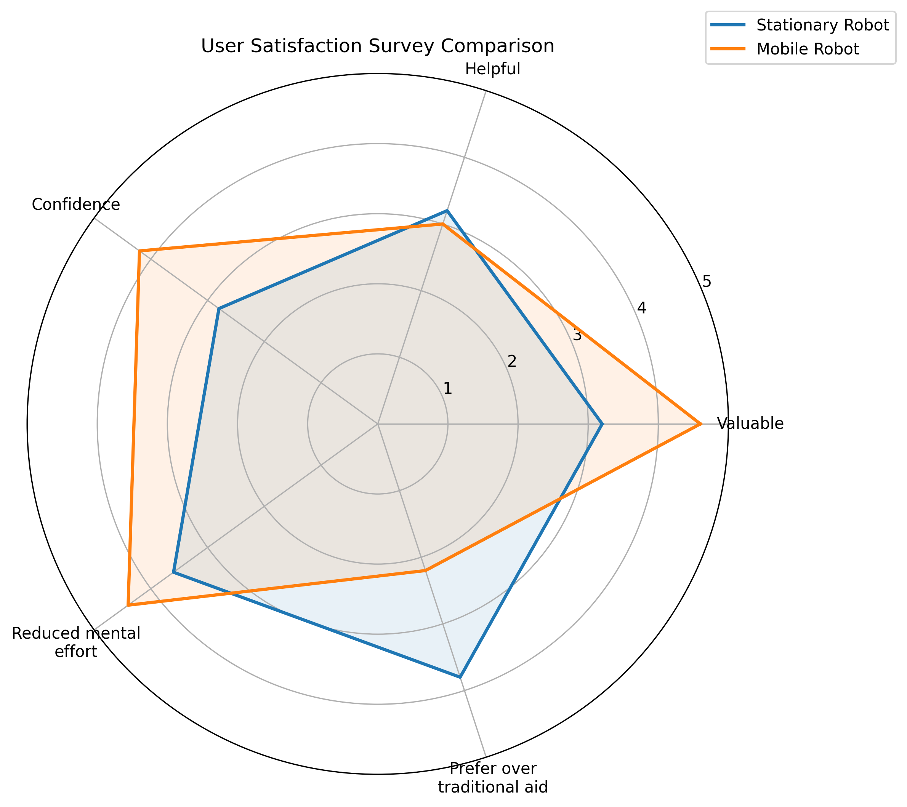

# Survey Data Visualisation

This script reads participant responses from `Survey_Data.csv`, processes the data, and produces three figures:

- `time_taken.png`
- `cognitive_load.png`
- `spider_plot.png`


## How the Data Was Processed

### 1. Row filtering
The CSV contains participant responses followed by extra summary rows at the bottom of the sheet.  
Only rows with a real timestamp in the `Timestamp` column were kept, which isolates the actual participant data.

### 2. Condition mapping
The original condition names in the CSV were renamed for plotting:

- `No Guidance` → `No Aid`
- `Speech Guidance` → `Static Aid`
- `Speech and Navigation Guidance` → `Mobile Aid`

### 3. Time taken chart
The script reads values from the `Time Taken (seconds)` column and computes the mean for each condition:

- No Aid
- Static Aid
- Mobile Aid

These averages are used to generate `time_taken.png`.


### 4. Cognitive load chart
Cognitive load is calculated as the average of four NASA-TLX-style columns for each participant:

- `How mentally demanding was the task?`
- `How hurried or rushed was the pace of the task?`
- `How hard did you have to work to accomplish your level of performance?`
- `How insecure, discouraged, irritated, stressed, and annoyed were you while completing the task?`

The script first computes a per-participant cognitive load score, then averages that score by condition to generate `cognitive_load.png`.

### 5. Radar / spider plot
The radar chart compares user satisfaction between the two robot-assisted conditions only:

- Static Aid
- Mobile Aid

It uses the mean values from these five survey items:

- `I found the guidance provided by the robot easy to understand.`
- `The robot helped me reach my destination efficiently.`
- `I felt confident navigating the station with the robot’s assistance.`
- `Using the robot reduced the mental effort required to navigate the station.`
- `I would prefer using this robot over traditional signage or maps.`

These are displayed as:

- Valuable
- Helpful
- Confidence
- Reduced mental effort
- Prefer over traditional aid

The resulting comparison is saved as `spider_plot.png`.

## Notes

- The user satisfaction bar chart was removed.
- Any non-numeric values are safely converted using `pd.to_numeric(..., errors="coerce")`.
- The radar plot excludes the `No Aid` condition because those robot-assistance questions do not apply there.

## Running the Script

Place the script and `Survey_Data.csv` in the same folder, then run:

```bash
python graphing.py
